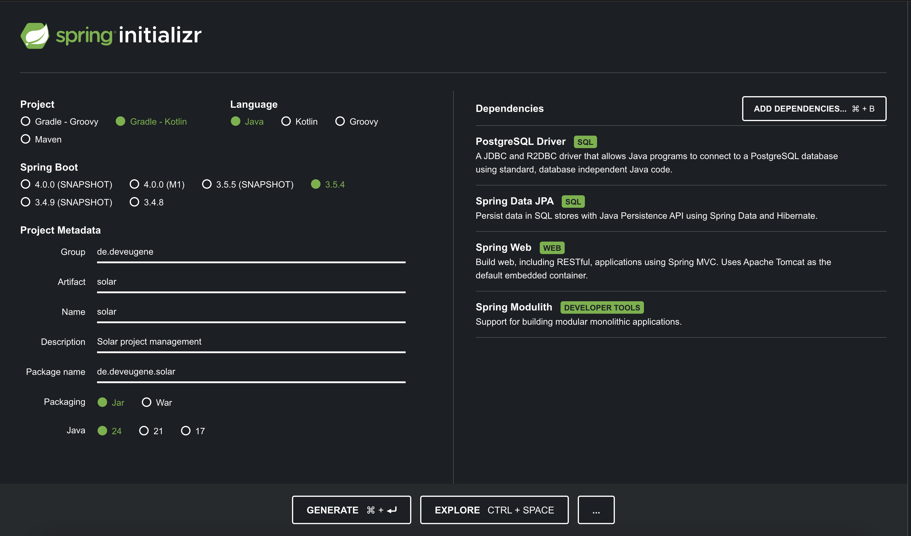
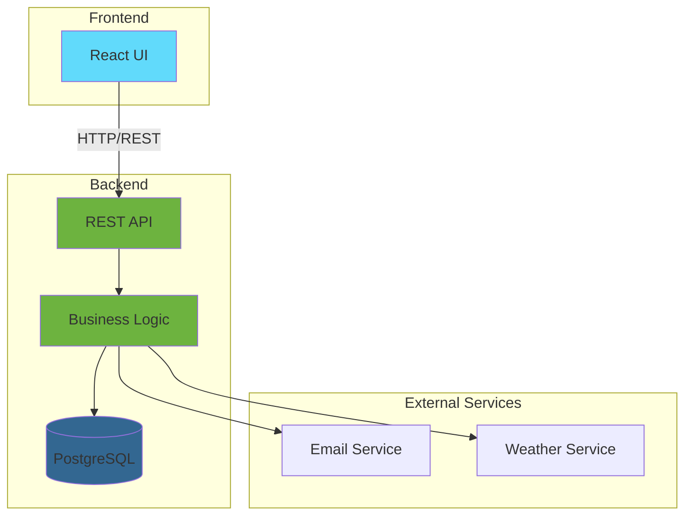
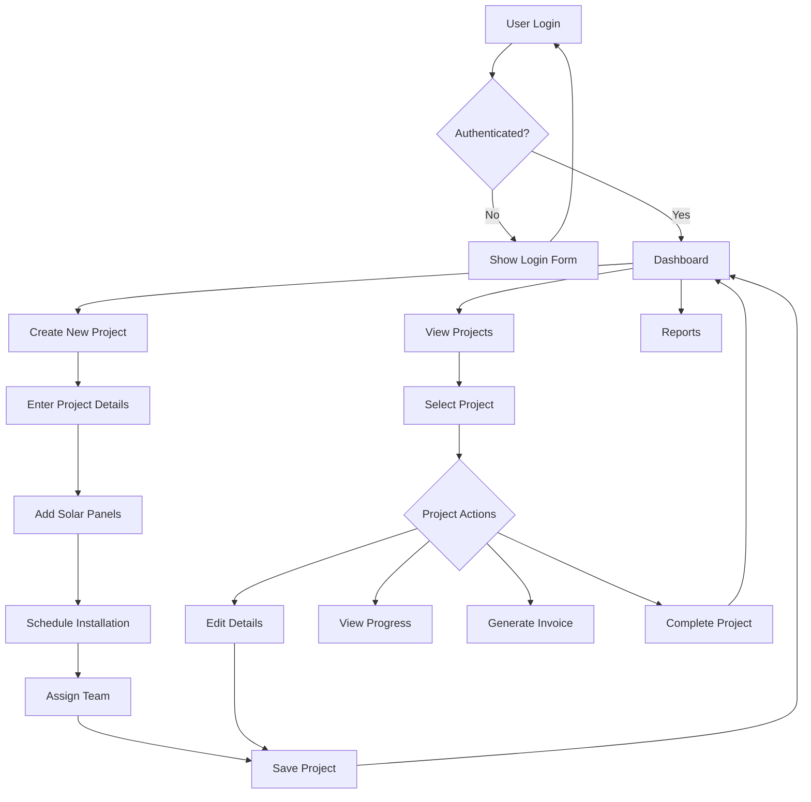
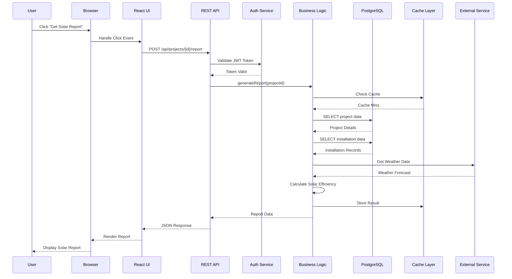

# Project documentation

Project is initialized with next spring initializr settings

# System architecture

There we have an examples (not implemented, on which we can iterate)

# User flow

# Request Flow

